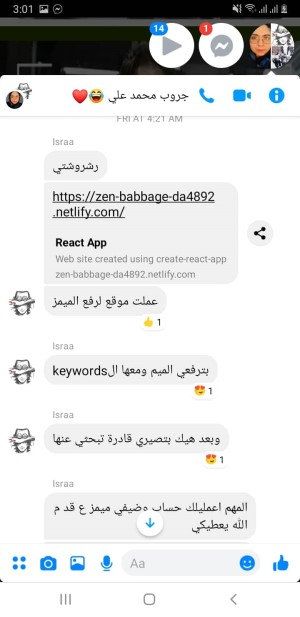

# MemeHub

Your ultimate solution to become a *Meme Lord*!

### What the heck is this?
This website gives you the ability to save your memes images with your own keywords so that when you need any you can search easily for it instead of trying to make google understand what you want and most of the times you don't find your precious meme!

##### Note
Uploaded meme will not appear immediately in the main page cuz we have to make sure it's really funny!
But you can still find it in the search results and it will be in your account page if you are signed in, so no worries!

### Stack used
- React + Context API
- Firebase API :heart:

### Inspiration
This project is inspired by a friend of mine who always has just the perfect meme for every situation, I was so jealous of her ability to interact very fast using memes while I struggle googling the meme that I want!

#### Any contribution is very welcomed :heart:
with an origami gift made by me :gift_heart:

